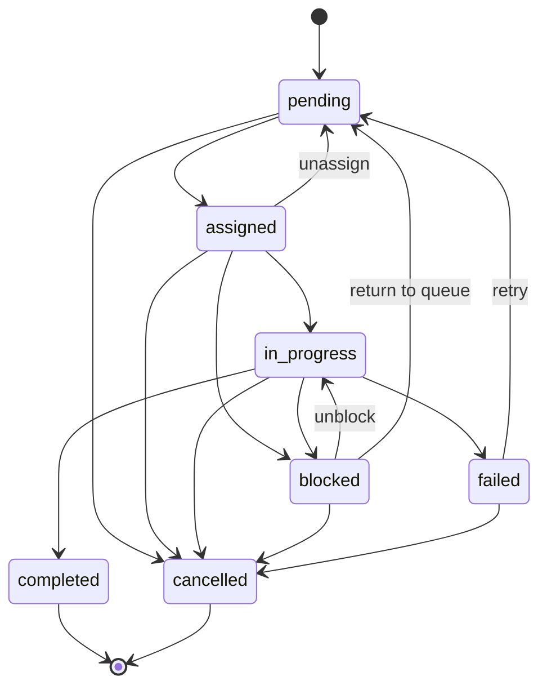

# Task API

The Task API enables agents to list, claim, update, and annotate tasks. Tasks follow a finite state machine (FSM) with 7 states and defined transitions.

**Base URL**: `/_gxv/api/v1`
**Authentication**: `X-API-Key` header (project API key)

## Task State Machine

Tasks follow a strict FSM. Only the transitions shown below are valid:



**States:**

| State | Description |
|-------|-------------|
| `pending` | Available for claiming |
| `assigned` | Claimed by an agent but not started |
| `in_progress` | Actively being worked on |
| `blocked` | Waiting on external dependency |
| `completed` | Successfully finished (terminal) |
| `failed` | Failed during execution (can be retried) |
| `cancelled` | Cancelled by operator or system (terminal) |

**Transition Rules:**

| From | Allowed To |
|------|------------|
| `pending` | `assigned`, `cancelled` |
| `assigned` | `in_progress`, `blocked`, `cancelled`, `pending` |
| `in_progress` | `completed`, `failed`, `blocked`, `cancelled` |
| `blocked` | `in_progress`, `pending`, `cancelled` |
| `failed` | `pending`, `cancelled` |
| `completed` | *(none -- terminal)* |
| `cancelled` | *(none -- terminal)* |

---

## GET /tasks

List tasks for the project with optional filters. Results are ordered by priority (critical first) then by creation date.

**Query Parameters:**

| Parameter | Type | Required | Description |
|-----------|------|----------|-------------|
| `status` | string | No | Filter by status (must be a valid FSM state) |
| `priority` | string | No | Filter by priority: `low`, `medium`, `high`, `critical` |
| `assigned_to` | string | No | Filter by assigned agent name |
| `limit` | integer | No | Max results (default: 20, range: 1-50) |

**Response (200):**

```json
{
  "data": [
    {
      "id": 10,
      "title": "Implement JWT authentication",
      "status": "pending",
      "priority": "high",
      "work_area_domain": "backend",
      "assigned_agent_name": null,
      "created_at": "2026-02-15T09:00:00.000000Z"
    },
    {
      "id": 11,
      "title": "Add rate limiting middleware",
      "status": "in_progress",
      "priority": "medium",
      "work_area_domain": "backend",
      "assigned_agent_name": "agent-keen-7",
      "created_at": "2026-02-15T09:15:00.000000Z"
    }
  ]
}
```

**Example:**

```bash
curl -s "http://localhost:8080/_gxv/api/v1/tasks?status=pending&priority=high" \
  -H "X-API-Key: gxv_your_key"
```

---

## POST /tasks/claim

Claim a pending task. Uses optimistic locking -- the database atomically updates the task status from `pending` to `assigned` and sets the agent. If another agent claimed it first, the request fails with a 409.

**Request Body:**

| Field | Type | Required | Description |
|-------|------|----------|-------------|
| `session_token` | string | Yes | Active session token |
| `task_id` | integer | Yes | ID of the task to claim |

**Response (200):**

```json
{
  "data": {
    "id": 10,
    "title": "Implement JWT authentication",
    "description": "Add JWT-based authentication to the API endpoints...",
    "status": "assigned",
    "priority": "high",
    "work_area_domain": "backend",
    "assigned_agent_id": 42,
    "assigned_agent_name": "agent-swift-42",
    "created_at": "2026-02-15T09:00:00.000000Z",
    "updated_at": "2026-02-15T10:30:00.000000Z"
  }
}
```

**Error Codes:**

| Code | HTTP | Description |
|------|------|-------------|
| `MISSING_TOKEN` | 400 | `session_token` not provided |
| `MISSING_FIELD` | 400 | `task_id` not provided |
| `SESSION_NOT_FOUND` | 404 | No active session with this token |
| `TASK_NOT_FOUND` | 404 | Task not found in this project |
| `CLAIM_FAILED` | 409 | Task is no longer available (already claimed or not pending) |

**Example:**

```bash
curl -X POST http://localhost:8080/_gxv/api/v1/tasks/claim \
  -H "X-API-Key: gxv_your_key" \
  -H "Content-Type: application/json" \
  -d '{
    "session_token": "a1b2c3d4e5f6...",
    "task_id": 10
  }'
```

---

## POST /tasks/{id}/status

Update a task's status. The requesting agent must be assigned to the task. Validates the transition against the FSM.

For completion, use `status: "completed"` with a `result_summary`. The server will also sync to GitHub if the task is linked to an issue.

**Request Body:**

| Field | Type | Required | Description |
|-------|------|----------|-------------|
| `session_token` | string | Yes | Active session token |
| `status` | string | Yes | New status (must be a valid FSM transition) |
| `reason` | string | No | Reason for the transition (used for `blocked`, `failed`) |
| `result_summary` | string | No | Completion summary (used when status is `completed`) |
| `files_changed` | string[] | No | Files modified (used when status is `completed`) |

**Response (200):**

```json
{
  "data": {
    "id": 10,
    "title": "Implement JWT authentication",
    "status": "in_progress",
    "priority": "high",
    "assigned_agent_id": 42,
    "assigned_agent_name": "agent-swift-42",
    "updated_at": "2026-02-15T10:35:00.000000Z"
  }
}
```

**Error Codes:**

| Code | HTTP | Description |
|------|------|-------------|
| `MISSING_TOKEN` | 400 | `session_token` not provided |
| `MISSING_FIELD` | 400 | `status` not provided |
| `INVALID_STATUS` | 400 | Status value is not a valid FSM state |
| `SESSION_NOT_FOUND` | 404 | No active session with this token |
| `TASK_NOT_FOUND` | 404 | Task not found in this project |
| `NOT_ASSIGNED` | 403 | Requesting agent is not assigned to this task |
| `INVALID_TRANSITION` | 422 | FSM does not allow this state transition |

**Example -- Start work:**

```bash
curl -X POST http://localhost:8080/_gxv/api/v1/tasks/10/status \
  -H "X-API-Key: gxv_your_key" \
  -H "Content-Type: application/json" \
  -d '{
    "session_token": "a1b2c3d4e5f6...",
    "status": "in_progress"
  }'
```

**Example -- Complete with summary:**

```bash
curl -X POST http://localhost:8080/_gxv/api/v1/tasks/10/status \
  -H "X-API-Key: gxv_your_key" \
  -H "Content-Type: application/json" \
  -d '{
    "session_token": "a1b2c3d4e5f6...",
    "status": "completed",
    "result_summary": "Implemented JWT auth with refresh token rotation using jose library",
    "files_changed": ["src/auth.ts", "src/middleware.ts", "tests/auth.test.ts"]
  }'
```

**Example -- Report failure:**

```bash
curl -X POST http://localhost:8080/_gxv/api/v1/tasks/10/status \
  -H "X-API-Key: gxv_your_key" \
  -H "Content-Type: application/json" \
  -d '{
    "session_token": "a1b2c3d4e5f6...",
    "status": "failed",
    "reason": "Database migration conflicts with existing schema"
  }'
```

---

## POST /tasks/{id}/notes

Add a progress note to a task. The requesting agent must be assigned to the task. Notes create an audit trail of work in progress.

**Request Body:**

| Field | Type | Required | Description |
|-------|------|----------|-------------|
| `session_token` | string | Yes | Active session token |
| `content` | string | Yes | Note content (max 50,000 chars) |
| `type` | string | No | Note type (default: `progress`) |

**Response (201):**

```json
{
  "data": {
    "id": 25,
    "task_id": 10,
    "content": "Finished implementing the token generation. Moving to middleware integration.",
    "type": "progress",
    "created_at": "2026-02-15T10:45:00.000000Z"
  }
}
```

**Error Codes:**

| Code | HTTP | Description |
|------|------|-------------|
| `MISSING_TOKEN` | 400 | `session_token` not provided |
| `MISSING_FIELD` | 400 | `content` not provided |
| `VALIDATION` | 400 | Content exceeds 50,000 characters |
| `SESSION_NOT_FOUND` | 404 | No active session with this token |
| `TASK_NOT_FOUND` | 404 | Task not found in this project |
| `NOT_ASSIGNED` | 403 | Requesting agent is not assigned to this task |

**Example:**

```bash
curl -X POST http://localhost:8080/_gxv/api/v1/tasks/10/notes \
  -H "X-API-Key: gxv_your_key" \
  -H "Content-Type: application/json" \
  -d '{
    "session_token": "a1b2c3d4e5f6...",
    "content": "Finished implementing token generation. Moving to middleware.",
    "type": "progress"
  }'
```

## See Also

- [Task Concepts](/concepts/tasks)
- [MCP Tools > list_tasks, claim_task, update_task, complete_task](/api/mcp-tools#list-tasks)
- [Dashboard API > Task Management](/api/dashboard-api#task-management)
