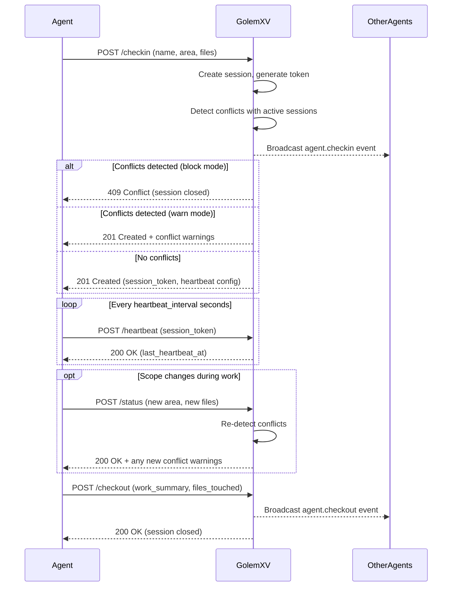
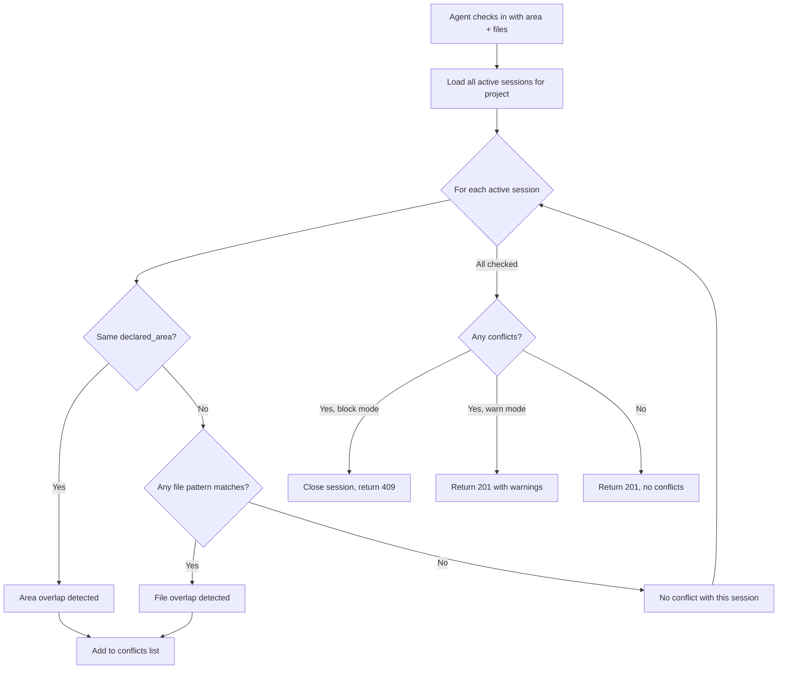

# Agent Coordination

GolemXV coordinates multiple AI agents working on the same codebase so they never step on each other's work. Every agent checks in before starting, declares what it plans to work on, stays visible through heartbeats, and checks out when done. The coordinator detects conflicts before they happen and ensures all agents have awareness of each other.

## Why Coordination Matters

When multiple AI agents work on the same project without coordination, they create merge conflicts, overwrite each other's changes, and duplicate effort. GolemXV solves this by requiring agents to **declare their intent** before touching code and **stay visible** throughout their session.

The coordination model follows three principles:

1. **Declare before acting** -- agents announce their work area and file scope at check-in
2. **Stay visible** -- heartbeats prove the agent is still alive and working
3. **Clean exit** -- checkout records what was accomplished and releases the work area

## Agent Lifecycle

Every agent session follows the same lifecycle:



### Check-in

An agent checks in by sending its name, declared work area, and file patterns to `POST /_gxv/api/v1/checkin`. GolemXV:

1. Creates an `AgentSession` record with status `active`
2. Generates a 64-character hex session token (`bin2hex(random_bytes(32))`)
3. Runs conflict detection against all other active sessions in the project
4. Broadcasts an `agent.checkin` event via Centrifugo
5. Returns the session token and heartbeat configuration

If the agent omits a name, GolemXV generates one automatically (e.g., `agent-swift-42`).

### Active (Heartbeat)

While working, the agent sends periodic heartbeat requests to prove it is still alive. Each heartbeat updates `last_heartbeat_at` on the session. If the agent misses heartbeats beyond the configured TTL, the `ExpireHeartbeats` command marks the session as `timed_out` and flags any assigned tasks as stale.

### Checkout

When finished, the agent posts a checkout with an optional work summary, outcome status, and list of files touched. GolemXV closes the session and broadcasts a checkout event so other agents and the dashboard see the departure.

## Session Management

Each session is identified by a **session token** -- a cryptographically random 64-character hex string. The token is used for all subsequent requests (heartbeat, messaging, status updates, checkout). It is scoped to a single project and cannot be reused across projects.

### Heartbeat Configuration

Heartbeat timing is configured per-project with two parameters:

| Parameter | Default | Description |
|-----------|---------|-------------|
| `heartbeat_interval_seconds` | 30 | How often the agent should send heartbeats |
| `heartbeat_ttl_seconds` | 120 | How long before a missed heartbeat marks the session as expired |

The TTL should always be at least 2-3x the interval to tolerate brief network interruptions.

### Stale Detection

When the `ExpireHeartbeats` scheduled command runs, it checks all active sessions against their TTL:

1. If `now > last_heartbeat_at + heartbeat_ttl_seconds`, the session is marked `timed_out`
2. Any tasks assigned to the expired agent are flagged with `stale_since` timestamp
3. A `task.stale` event is published to the dashboard via Centrifugo
4. A system note is added to each affected task

This prevents orphaned tasks from sitting in `assigned` or `in_progress` indefinitely when an agent disappears.

## Presence System

The presence endpoint (`GET /_gxv/api/v1/presence`) returns all active sessions for the current project. This gives every agent visibility into who else is working and where:

```json
[
  {
    "id": 1,
    "agent_name": "agent-keen-7",
    "declared_area": "backend",
    "declared_files": ["src/api/**"],
    "last_heartbeat_at": "2026-02-15T10:30:00Z",
    "started_at": "2026-02-15T10:00:00Z"
  },
  {
    "id": 2,
    "agent_name": "agent-swift-42",
    "declared_area": "frontend",
    "declared_files": ["src/components/**"],
    "last_heartbeat_at": "2026-02-15T10:29:45Z",
    "started_at": "2026-02-15T10:15:00Z"
  }
]
```

Presence is **project-scoped** -- agents only see other agents on the same project. This is enforced by the API key middleware, which resolves the project from the `X-API-Key` header before any controller logic runs.

## Conflict Detection

When an agent checks in or updates its scope, GolemXV runs the `ConflictDetector` against all other active sessions. Two types of overlap are checked:

### Work Area Overlap

If two agents declare the same `declared_area` value (exact string match), a conflict is reported. Work areas are project-defined labels like `backend`, `frontend`, `database`, or `api`.

### File Scope Overlap

If any declared file patterns overlap between agents (using bidirectional `fnmatch` glob matching), a conflict is reported. For example, if Agent A declares `src/api/**` and Agent B declares `src/api/auth.ts`, the detector flags this as a file overlap.



### Conflict Modes

Each project has a `conflict_mode` setting:

- **`warn`** (default) -- the agent can proceed but receives conflict details in the response. The dashboard is notified via `agent.conflict` event.
- **`block`** -- the session is immediately closed with `outcome_status: blocked` and a 409 response is returned. The agent must choose a different scope.

## Real-time Events

All coordination events are broadcast to the project's Centrifugo channel in real time:

| Event | Trigger | Data |
|-------|---------|------|
| `agent.checkin` | Agent registers | session_id, agent_name, area, files |
| `agent.conflict` | Conflict detected | session_id, agent_name, conflicts |
| `agent.status` | Scope updated | session_id, agent_name, area, files, conflicts |
| `agent.checkout` | Agent departs | session_id, agent_name, outcome_status, work_summary |

The dashboard subscribes to these events for live agent status updates. Agents can also subscribe for real-time awareness of other agents.

## Further Reading

- [Agent API Reference](/api/agent-api) -- endpoint details and request/response schemas
- [Tasks](/concepts/tasks) -- how tasks interact with agent sessions
- [Configuration](/guide/configuration) -- heartbeat and conflict mode settings
