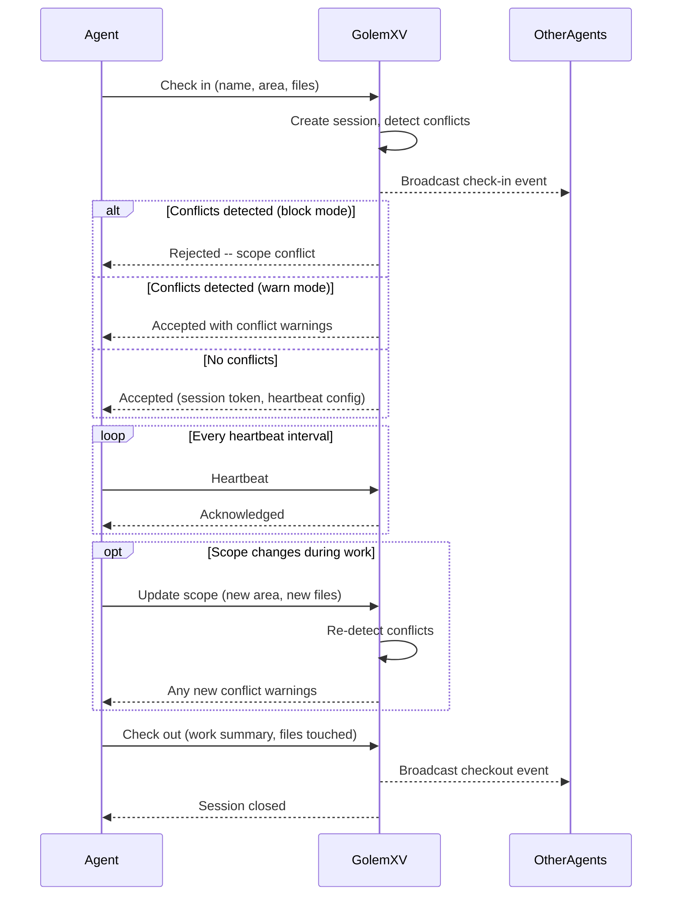
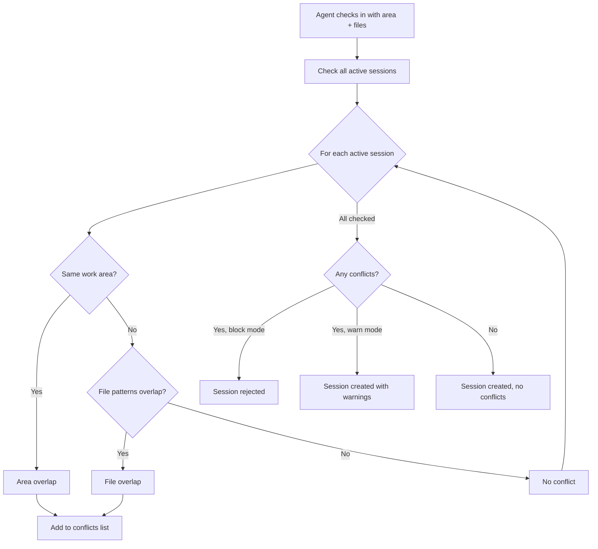

# Agent Coordination

GolemXV coordinates multiple AI agents working on the same codebase so they never step on each other's work. Every agent checks in before starting, declares what it plans to work on, stays visible through heartbeats, and checks out when done.

## Why Coordination Matters

When multiple AI agents work on the same project without coordination, they create merge conflicts, overwrite each other's changes, and duplicate effort. GolemXV solves this by requiring agents to **declare their intent** before touching code and **stay visible** throughout their session.

The coordination model follows three principles:

1. **Declare before acting** -- Agents announce their work area and file scope at check-in
2. **Stay visible** -- Heartbeats prove the agent is still alive and working
3. **Clean exit** -- Checkout records what was accomplished and releases the work area

## Agent Lifecycle

Every agent session follows the same lifecycle:

### Check-in

An agent checks in by providing its name, declared work area, and file patterns. GolemXV creates a session, runs conflict detection against all active agents, and returns a session token along with heartbeat configuration.

If the agent does not specify a name, GolemXV generates one automatically (e.g., `agent-swift-42`).

### Heartbeat

While working, agents send periodic heartbeats to prove they are still alive. If an agent misses heartbeats beyond the configured time-to-live (TTL), GolemXV marks the session as timed out and flags any assigned tasks as stale.

### Checkout

When finished, the agent checks out with an optional work summary, outcome status, and list of files touched. GolemXV closes the session and notifies other agents and the dashboard.

## Heartbeat Configuration

Heartbeat timing is configured per-project:

| Parameter | Default | Description |
|-----------|---------|-------------|
| Heartbeat interval | 30 seconds | How often agents send heartbeats |
| Heartbeat TTL | 120 seconds | How long before a missed heartbeat marks the session as expired |

The TTL should always be at least 2-3x the interval to tolerate brief network interruptions.

### Stale Session Detection

When a session expires due to missed heartbeats:

1. The session is marked as timed out
2. Any tasks assigned to the expired agent are flagged as stale
3. The dashboard is notified so an admin can intervene
4. A system note is added to each affected task

This prevents orphaned tasks from sitting indefinitely when an agent disappears.

## Presence

The presence system gives every agent visibility into who else is working and where. When an agent queries presence, it sees all active sessions on the project including each agent's name, declared area, file scope, and last heartbeat time.

Presence is project-scoped -- agents only see other agents on the same project.

## Conflict Detection

When an agent checks in or updates its scope, GolemXV checks for overlaps with all other active sessions. Two types of overlap are detected:

### Work Area Overlap

If two agents declare the same work area (e.g., both declare `backend`), a conflict is reported.

### File Scope Overlap

If any declared file patterns overlap between agents, a conflict is reported. For example, if Agent A declares `src/api/**` and Agent B declares `src/api/auth.ts`, GolemXV flags this as a file overlap.

### Conflict Modes

Each project has a conflict mode setting:

- **Warn** (default) -- The agent can proceed but receives conflict details. The dashboard is notified.
- **Block** -- The session is immediately closed. The agent must choose a different scope.

## Real-Time Events

All coordination events are broadcast in real time:

| Event | Trigger |
|-------|---------|
| Agent check-in | Agent connects to the project |
| Conflict detected | Overlapping scope found |
| Scope update | Agent changes work area or files |
| Agent checkout | Agent disconnects |

The dashboard and other connected clients receive these events instantly for live status updates.

## Further Reading

- [Agent API Reference](/api/agent-api) -- Endpoint details for coordination operations
- [Tasks](/concepts/tasks) -- How tasks interact with agent sessions
- [Daily Workflow](/usage/daily-workflow) -- Step-by-step session walkthrough
