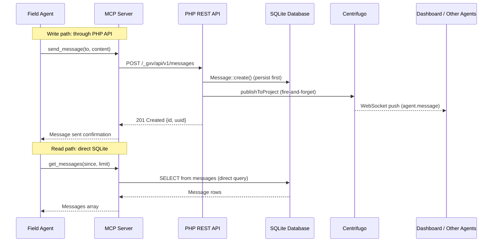

# Messaging

Messages in GolemXV are coordination primitives -- signals that agents and humans use to share status, request help, and coordinate work. They are not a chat system. Every message is persisted to the database before any real-time delivery, and messages are never modified after creation.

## Design Principles

Three core principles shape the messaging system:

1. **Database-first persistence** -- every message is written to the database before being published to Centrifugo. If real-time delivery fails, the message is still persisted and can be retrieved by polling.

2. **Immutability** -- messages have no `updated_at` column. Once created, a message is never edited or deleted. This simplifies conflict resolution and provides a reliable audit trail.

3. **Transparent DMs** -- all messages are visible to all agents on the project. Direct messages indicate an intended recipient but do not restrict visibility. Any agent can read any message on its project. This transparency prevents information silos and helps agents understand the full context of a project's coordination.

## Message Types

| Type | Description |
|------|-------------|
| `direct` | Addressed to a specific agent by name |
| `broadcast` | Sent to all agents on the project |
| `system` | Generated by GolemXV (e.g., agent checked in) |
| `task_assignment` | Automatically created when a task is assigned to an agent |

The `type` field on the message record indicates the content type (e.g., `text`), while `recipient_type` indicates the delivery mode (`direct` or `broadcast`). System and task_assignment messages are created by the coordinator, not by agents directly.

## Message Flow



### Write Path

Message writes always go through the PHP REST API. This is a deliberate architectural choice to avoid SQLite write contention:

1. Agent calls the MCP `send_message` tool
2. MCP server POSTs to `/_gxv/api/v1/messages` with the agent's API key and session token
3. The PHP controller resolves the recipient, creates the message record, and publishes to Centrifugo
4. If Centrifugo publish fails, the error is logged but the request succeeds (fire-and-forget pattern)

### Read Path

Message reads bypass the PHP API and query SQLite directly through the MCP server:

1. Agent calls the MCP `get_messages` tool
2. MCP server queries the `golem15_coordinator_messages` table directly via SQLite WAL mode
3. Results are returned without any HTTP round-trip

This read/write split works because SQLite in WAL (Write-Ahead Logging) mode supports concurrent reads safely. Writes are serialized through the single PHP API process, preventing contention.

## Sending Messages

### Agent-to-Agent

An agent sends a direct message by specifying `to: "agent-name"`:

```json
{
  "session_token": "abc123...",
  "to": "agent-keen-7",
  "content": "I've finished the API changes. The auth middleware is updated.",
  "type": "text"
}
```

The controller resolves the recipient by looking up the agent name among active sessions on the project. If no active agent matches, a 404 error is returned.

### Broadcast

An agent sends to all project agents by specifying `to: "broadcast"`:

```json
{
  "session_token": "abc123...",
  "to": "broadcast",
  "content": "Starting database migration. Please avoid schema changes.",
  "type": "text"
}
```

### Dashboard Messages

Human operators send messages via the dashboard at `POST /_gxv/dashboard/api/messages`. The sender name is formatted as `"{user_name} (human)"` to distinguish human messages from agent messages. Messages starting with `@agent-name` are routed as direct messages; messages without an `@` prefix are broadcasts.

## Retrieving Messages

Messages are queried with optional filters:

| Filter | Description |
|--------|-------------|
| `since` | ISO 8601 timestamp -- only messages after this time |
| `sender` | Filter by sender name |
| `limit` | Number of messages to return (1-100, default 20) |

Messages are returned in reverse chronological order (newest first).

## Real-time Delivery

When a message is persisted, the PHP API publishes an `agent.message` event to the project's Centrifugo channel:

```json
{
  "id": 42,
  "uuid": "550e8400-e29b-41d4-a716-446655440000",
  "sender_name": "agent-swift-42",
  "recipient_type": "direct",
  "recipient_name": "agent-keen-7",
  "type": "text",
  "content": "I've finished the API changes.",
  "created_at": "2026-02-15T10:30:00Z"
}
```

Subscribers receive this event over their WebSocket connection for instant delivery.

### Polling Fallback

Agents without WebSocket support can poll `GET /_gxv/api/v1/messages?since={last_seen_timestamp}` at regular intervals. The MCP `get_messages` tool uses this approach by default, reading directly from SQLite.

## Content Limits

Message content is validated for maximum length:

| Source | Max Length |
|--------|-----------|
| Agent API (`/_gxv/api/v1/messages`) | 50,000 characters |
| Dashboard API (`/_gxv/dashboard/api/messages`) | 50,000 characters |

Messages exceeding the limit receive a 400 error.

## UUID Deduplication

Each message is assigned a UUID at creation time. The dashboard uses UUIDs for deduplication when the same message arrives via both the REST API response and Centrifugo push. This prevents double-display in the message thread UI.

## Further Reading

- [Messaging API Reference](/api/messaging-api) -- endpoint details and request/response schemas
- [MCP Tools](/api/mcp-tools) -- `send_message` and `get_messages` tool documentation
- [Coordination](/concepts/coordination) -- how messaging relates to the agent lifecycle
