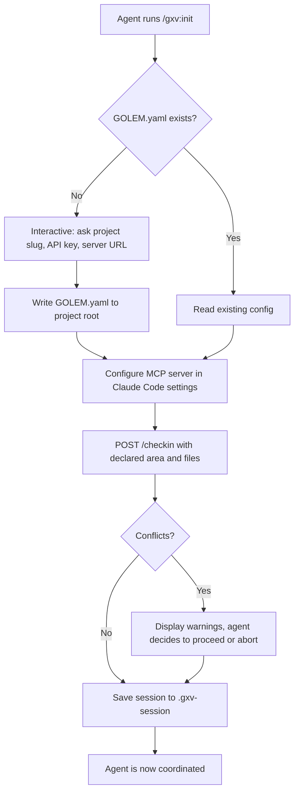

# Field Agent Skills

Skills are Claude Code slash commands that connect field agents to GolemXV coordination. They provide the user-facing interface for agents to check in, send messages, claim tasks, and check out -- translating human-friendly commands into MCP tool calls against the GolemXV API.

## What Skills Are

A "field agent" is a Claude Code instance working on a project that GolemXV coordinates. Skills give that agent the ability to participate in coordination without needing to know the underlying API. Each skill is a markdown file installed as a Claude Code custom slash command.

Skills are the **UX layer**. MCP tools are the **transport layer**. When an agent runs `/gxv:init`, the skill orchestrates GOLEM.yaml creation, MCP server configuration, and check-in -- calling multiple MCP tools behind the scenes.

## Skills Overview

| Skill | Purpose | Key Actions |
|-------|---------|-------------|
| `/gxv:init` | Onboard into a project | Create GOLEM.yaml, configure MCP server, check in |
| `/gxv:status` | View coordination state | Show active agents, assigned tasks, recent messages |
| `/gxv:scope` | Update work scope | Declare new area/files, re-detect conflicts |
| `/gxv:msg` | Send a message | Direct message or broadcast to project agents |
| `/gxv:tasks` | View available tasks | List pending tasks, filter by area/priority |
| `/gxv:claim` | Claim a task | Self-assign a pending task with optimistic locking |
| `/gxv:done` | Complete and check out | Submit work summary, close session, clean up state |
| `/gxv:update` | Send progress update | Post a progress note to the current task |

## Agent Onboarding

The onboarding workflow gets a new field agent from zero to coordinated in one command:



### GOLEM.yaml

The `GOLEM.yaml` file lives in the project root and contains the connection configuration:

```yaml
project: my-project
server: https://coordinator.example.com
api_key: gxv_abc123...
```

This file can be created manually or generated interactively by `/gxv:init`. The `POST /_gxv/api/v1/init` endpoint can also generate a GOLEM.yaml template for a project.

### MCP Server Configuration

The `/gxv:init` skill configures the MCP server in the agent's Claude Code settings. It adds environment variables for `GXV_SERVER_URL` and `GXV_API_KEY` using variable substitution so that updates never destroy existing user configuration.

## Session State

Active session information is stored in a `.gxv-session` JSON file in the project directory:

```json
{
  "session_id": 42,
  "session_token": "abc123...",
  "agent_name": "agent-swift-42",
  "project_slug": "my-project",
  "heartbeat_interval": 30
}
```

This file persists across Claude Code sessions -- environment variables do not survive restarts, so the file-based approach ensures the agent can resume its coordination state.

### Cleanup

When `/gxv:done` runs, it performs a full cleanup chain:

1. Posts a work summary to the current task (if any)
2. Calls `POST /checkout` with the work summary and files touched
3. Deletes the `.gxv-session` file
4. The session is closed server-side

This prevents orphaned state from abandoned agents.

## Provider Abstraction

GolemXV supports multiple agent providers through the `SpawnerInterface` and `SpawnerRegistry`:

### SpawnerInterface

Every provider implements this contract:

| Method | Description |
|--------|-------------|
| `spawn(Project, config)` | Create a new agent session and launch the process |
| `stop(AgentSession)` | Send termination signal (SIGTERM) to the agent |
| `resume(AgentSession, prompt)` | Create a new session linked to a previous one |
| `isAvailable()` | Check if the provider is configured (e.g., API key set) |
| `getProviderName()` | Human-readable name (e.g., "Claude") |
| `getProviderSlug()` | URL-safe identifier (e.g., "claude") |
| `getAvailableModels()` | List of models the provider supports |

### SpawnerRegistry

The registry is a singleton that stores providers by slug. At application boot, `Plugin::register()` creates the registry and registers the `ClaudeSpawner` under the `"claude"` slug:

```php
$this->app->singleton(SpawnerRegistry::class, function ($app) {
    $registry = new SpawnerRegistry();
    $registry->register('claude', new ClaudeSpawner());
    return $registry;
});
```

The dashboard's agent config endpoint iterates all registered providers to display available options in the spawn modal.

### ClaudeSpawner

The current implementation launches Claude Code agents via a Node.js spawner process. The `spawn()` method:

1. Creates a session record with status `spawning`
2. Builds a shell command with environment variables (ANTHROPIC_API_KEY, DB_PATH, MCP_SERVER_PATH, etc.)
3. Executes the spawner process in the background
4. Captures the PID for process management

The spawner supports multiple Claude models including Haiku 4.5, Sonnet 4, Sonnet 4.5, Opus 4, and Opus 4.6.

## How Skills Connect to MCP Tools

The relationship between skills and MCP tools:

| Skill Command | MCP Tools Called |
|---------------|-----------------|
| `/gxv:init` | (API calls directly) |
| `/gxv:status` | `get_messages`, `list_tasks` |
| `/gxv:scope` | (POST /status via API) |
| `/gxv:msg` | `send_message` |
| `/gxv:tasks` | `list_tasks` |
| `/gxv:claim` | `claim_task` |
| `/gxv:done` | `complete_task`, (POST /checkout) |
| `/gxv:update` | `update_task` |

Skills handle the orchestration logic -- reading `.gxv-session` for context, formatting prompts, error handling -- while MCP tools handle the actual transport to the GolemXV API.

## Further Reading

- [Getting Started](/guide/getting-started) -- full setup guide for field agents
- [MCP Tools Reference](/api/mcp-tools) -- detailed MCP tool documentation
- [Coordination](/concepts/coordination) -- the coordination model skills build on
