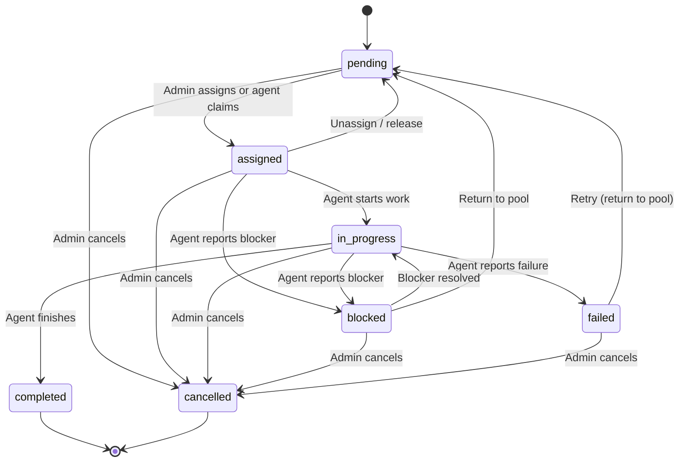
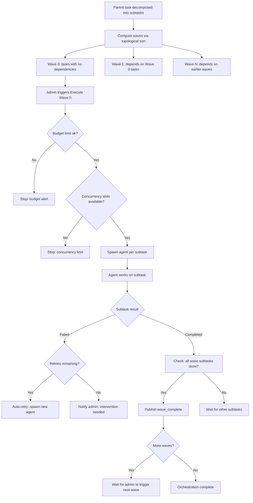

# Tasks

Tasks are the units of work in GolemXV. Each task has a title, description, priority, and a lifecycle managed by a finite state machine. Tasks can be assigned by an admin, self-claimed by agents, decomposed into subtask dependency graphs by AI, and orchestrated across multiple concurrent agents.

## Task Lifecycle

Every task moves through states governed by the `TaskFsm` -- a static finite state machine with 7 states and 15 transitions:



**Terminal states:** `completed` and `cancelled` have no outgoing transitions. Once a task reaches either state, it cannot change.

**Transition validation:** Every state change goes through `TaskFsm::canTransition()`, which checks the transition map before allowing the update. Invalid transitions throw an `InvalidArgumentException`.

**Status notes:** Each transition automatically creates a `TaskNote` record documenting the change, including the old state, new state, and optional reason.

## Assignment Models

Tasks can be assigned through two paths:

### Admin Assignment

A dashboard admin assigns a task to a specific agent via `POST /_gxv/dashboard/api/tasks/{id}/assign`. This:

1. Validates the FSM allows the transition (pending to assigned)
2. Sets `assigned_agent_id` and `assigned_agent_name` on the task
3. Creates a `task_assignment` message delivered to the agent via the messaging system
4. Publishes a `task.assigned` Centrifugo event

### Agent Self-Claim

An agent claims an unassigned pending task via `POST /_gxv/api/v1/tasks/claim`. This uses **optimistic locking** to prevent double-assignment:

```sql
UPDATE tasks
SET status = 'assigned',
    assigned_agent_id = :agent_id,
    assigned_agent_name = :agent_name,
    assigned_at = NOW()
WHERE id = :task_id
  AND status = 'pending'
  AND assigned_agent_id IS NULL
```

If another agent already claimed the task, `affected_rows` returns 0 and the claim fails gracefully. There is no lock contention or race condition -- the database guarantees atomicity.

**Concurrency advisory:** Before claiming, GolemXV checks if the agent already has an active task (assigned or in_progress). If so, the claim is rejected. This is an advisory check at the application level, not an atomic database constraint, and is appropriate for the expected scale of 5-10 concurrent agents.

## Task Completion

When an agent completes a task, it sends a status update with `result_summary` and optionally `files_changed`. The `TaskService::completeTask()` method:

1. Saves the result summary and files changed on the task record
2. Transitions the task to `completed` via the FSM
3. If the task is linked to a GitHub issue, dispatches a `PostTaskCompletionToGitHub` job that posts a completion comment and closes the issue

## Task Decomposition

Complex tasks can be broken down into subtask dependency graphs using AI. The `DecompositionService` sends the task to the Anthropic Messages API with a structured output schema, producing a validated decomposition.

### How Decomposition Works

1. **Admin triggers decomposition** via `POST /_gxv/dashboard/api/tasks/{id}/decompose`
2. The service builds a prompt with:
   - Task title and description
   - Project work areas (names, slugs, descriptions)
   - Currently active tasks (to avoid duplication)
   - Active agent count
3. The Anthropic API returns a JSON response matching the decomposition schema:
   - `rationale` -- explanation of the decomposition reasoning
   - `subtasks[]` -- each with id, title, description, work_area, priority, size, depends_on
4. The response is validated and returned as a **preview** (not yet persisted)

### Saving a Decomposition

After reviewing (and optionally editing) the preview, the admin saves it via `POST /_gxv/dashboard/api/tasks/{id}/decomposition`. This:

1. Validates the dependency graph (no duplicate IDs, no missing references, no cycles)
2. Computes wave assignments via topological sort
3. Creates `Task` records for each subtask with `parent_task_id` pointing to the original
4. Inserts dependency edges in the `task_dependencies` pivot table

### Dependency Graph Validation

Before saving, `DecompositionService::validateDependencyGraph()` checks:

- No duplicate subtask IDs
- All `depends_on` references point to existing subtask IDs
- No circular dependencies (detected via `computeWaves()`)

## Task Orchestration

Once a decomposition is saved, the `TaskOrchestrator` manages wave-based execution:



### Wave Computation

Waves are computed via inline topological sort. Tasks with no dependencies go in Wave 0. Tasks whose dependencies are all in Wave 0 go in Wave 1, and so on. Circular dependencies are detected and rejected with a `RuntimeException`.

### Wave Execution

Each wave is executed via `POST /_gxv/dashboard/api/tasks/{id}/orchestration/execute`. The orchestrator:

1. Checks the budget limit (`budget_limit_usd` on the parent task)
2. Checks concurrency limits (`max_concurrent_agents`, default 5)
3. Spawns an agent for each pending subtask in the wave via `ClaudeSpawner::spawn()`
4. Assigns each subtask to its spawned agent via `TaskService::assignTask()`

**Wave advancement is manual.** After a wave completes, the admin must approve and trigger the next wave. This is by design -- it provides a checkpoint for reviewing results before committing to more agent work.

### Completion Hooks

When a subtask transitions to `completed` or `failed`, `TaskService::transitionTask()` triggers `TaskOrchestrator::onSubtaskComplete()`:

1. Checks if all subtasks in the wave are in a final state
2. For failed subtasks: auto-retries up to `max_retries` by spawning a new agent with failure context
3. If all retries exhausted: publishes `orchestration.failed` for admin intervention
4. If wave succeeds: publishes `orchestration.wave_complete`
5. If all waves complete: dispatches `GenerateCompletionSummary` job and publishes `orchestration.complete`

### Cancellation

`POST /_gxv/dashboard/api/tasks/{id}/orchestration/cancel` cancels all non-final subtasks:

- **Pending/assigned** subtasks are transitioned to `cancelled`
- **In-progress** subtasks have their agent processes stopped (SIGTERM by default, SIGKILL with `immediate: true`) before being cancelled

## GitHub Integration

Tasks can be linked to GitHub issues for bidirectional synchronization:

**Inbound (GitHub to GolemXV):**
- A GitHub issue labeled with the project's trigger label auto-creates a GolemXV task
- Closing a GitHub issue updates the linked task (completed if in_progress, cancelled otherwise)
- Webhook HMAC-SHA256 signature verification prevents forgery

**Outbound (GolemXV to GitHub):**
- Completing a task dispatches `PostTaskCompletionToGitHub` which posts a markdown comment and closes the issue
- A footer marker (`"Posted by GolemXV Coordinator"`) prevents sync loops
- The `github_synced_at` timestamp provides additional loop detection

## Further Reading

- [Task API Reference](/api/task-api) -- agent-facing task endpoints
- [Dashboard API Reference](/api/dashboard-api) -- admin task management, decomposition, and orchestration endpoints
- [Coordination](/concepts/coordination) -- how agent sessions interact with task assignment
