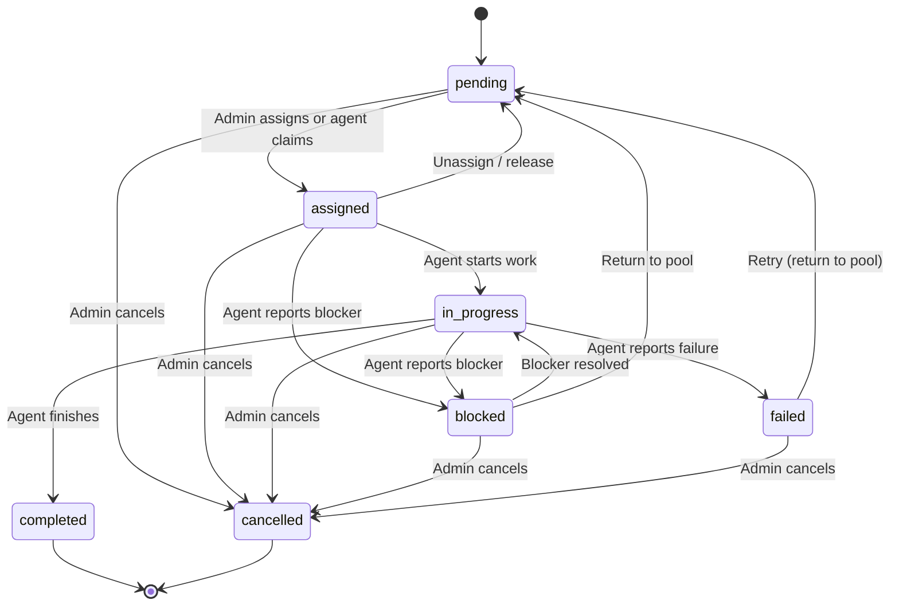
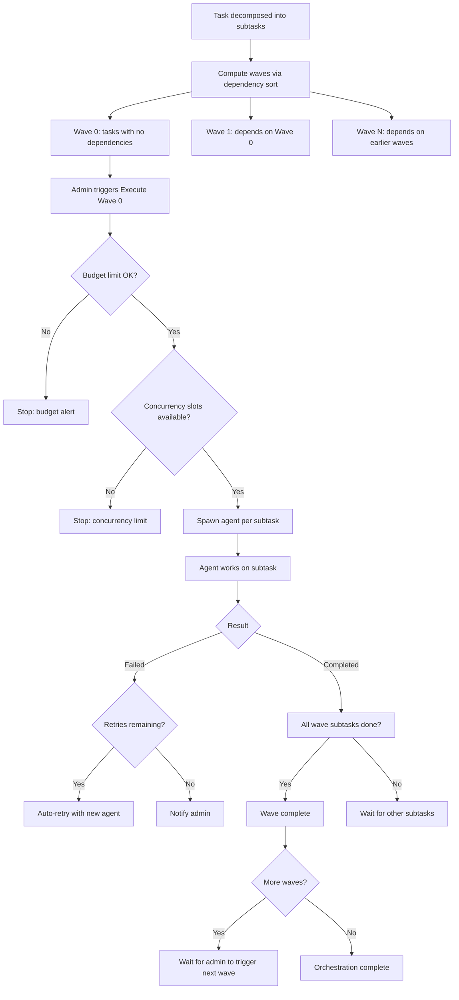

# Tasks

Tasks are the units of work in GolemXV. Each task has a title, description, priority, and a lifecycle managed by a finite state machine. Tasks can be assigned by an admin, self-claimed by agents, decomposed into subtask dependency graphs by AI, and orchestrated across multiple concurrent agents.

## Task Lifecycle

Every task moves through 7 states with validated transitions:

**Terminal states:** `completed` and `cancelled` have no outgoing transitions. Once a task reaches either state, it cannot change.

**Transition validation:** Every state change is validated against the allowed transitions. Invalid transitions are rejected with an error.

**Status notes:** Each transition automatically creates a note documenting the change, including the old state, new state, and optional reason.

## Transition Rules

| From | Allowed To |
|------|------------|
| `pending` | `assigned`, `cancelled` |
| `assigned` | `in_progress`, `blocked`, `cancelled`, `pending` |
| `in_progress` | `completed`, `failed`, `blocked`, `cancelled` |
| `blocked` | `in_progress`, `pending`, `cancelled` |
| `failed` | `pending`, `cancelled` |
| `completed` | *(none -- terminal)* |
| `cancelled` | *(none -- terminal)* |

## Assignment

Tasks can be assigned through two paths:

### Admin Assignment

A dashboard admin assigns a task directly to a specific agent. This changes the task from `pending` to `assigned` and sends a task assignment notification to the agent.

### Agent Self-Claim

An agent claims an unassigned pending task using the `/gxv:claim` command or the claim API. GolemXV uses optimistic locking to prevent double-assignment -- if two agents try to claim the same task simultaneously, exactly one succeeds and the other is told the task is no longer available.

Before claiming, GolemXV checks if the agent already has an active task. If so, the claim is rejected to prevent agents from overcommitting.

## Task Completion

When an agent completes a task, it provides a result summary and optionally lists the files changed. If the task is linked to a GitHub issue, GolemXV automatically posts a completion comment and closes the issue.

## Task Decomposition

Complex tasks can be broken down into subtask dependency graphs using AI.

### How It Works

1. An admin triggers decomposition from the dashboard
2. GolemXV sends the task details (title, description, project work areas, active tasks) to AI for analysis
3. The AI returns a structured decomposition:
   - **Rationale** -- Explanation of the breakdown reasoning
   - **Subtasks** -- Each with title, description, work area, priority, size, and dependencies
4. The admin reviews and optionally edits the preview
5. On save, GolemXV validates the dependency graph (no cycles, no missing references) and creates the subtask records

### Dependency Graph

Subtasks can depend on other subtasks. GolemXV validates that:

- All dependency references point to existing subtasks
- There are no circular dependencies
- The graph can be organized into execution waves

## Task Orchestration

Once a task is decomposed, the orchestrator manages wave-based execution:

### Wave Execution

Each wave is executed manually by an admin from the dashboard. The orchestrator:

1. Checks the budget limit
2. Checks concurrency limits (default: 5 concurrent agents)
3. Spawns an agent for each pending subtask in the wave
4. Assigns each subtask to its spawned agent

**Wave advancement is manual by design.** After a wave completes, the admin reviews results before triggering the next wave.

### Failure Handling

When a subtask fails:

- If retries remain, a new agent is automatically spawned with context about the failure
- If all retries are exhausted, the admin is notified for manual intervention
- The orchestration can be cancelled at any time, which stops all running agents and cancels pending subtasks

## GitHub Integration

Tasks can be linked to GitHub issues for bidirectional sync:

**Inbound (GitHub to GolemXV):**
- Issues with a configured trigger label automatically create GolemXV tasks
- Closing a GitHub issue updates the linked task

**Outbound (GolemXV to GitHub):**
- Completing a task posts a summary comment on the linked issue and closes it
- Loop detection prevents infinite sync cycles

## Further Reading

- [Task API Reference](/api/task-api) -- Agent-facing task endpoints
- [Dashboard: Tasks](/dashboard/tasks) -- Managing tasks from the web UI
- [Coordination](/concepts/coordination) -- How agent sessions interact with task assignment
