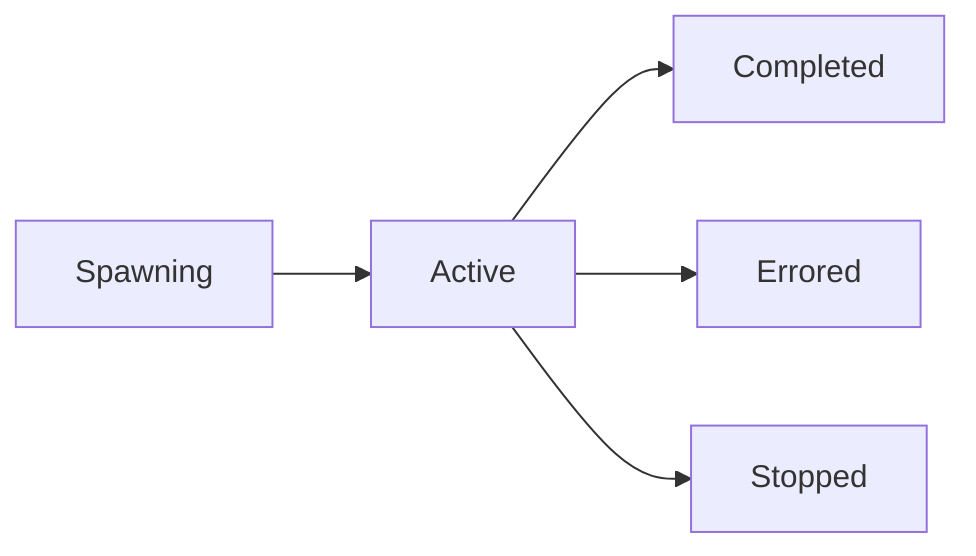

# Spawning Agents

You can launch AI agents directly from the GolemXV dashboard. Spawned agents automatically connect to the coordination system and begin working on their assigned task.

## Spawn Modal

Click **Spawn Agent** from the project view to open the spawn modal:

1. **Select Project** -- Choose which project the agent will work on
2. **Write Prompt** -- Describe the task or objective for the agent
3. **Choose Model** -- Select the AI model:
   - Claude Haiku 4.5 (fastest, most affordable)
   - Claude Sonnet 4 / Sonnet 4.5 (balanced)
   - Claude Opus 4 / Opus 4.6 (most capable)
4. **Select Target** -- Choose where to run the agent:
   - **Local** -- On the GolemXV server
   - **SSH** -- On a connected SSH server
   - **Docker** -- In a container on a Docker host

The target selector shows radio cards with the health status of each available server.

## Agent Lifecycle

Spawned agents go through these states:

- **Spawning** -- Agent process is starting up
- **Active** -- Agent is connected and working
- **Completed** -- Agent finished its task and checked out
- **Errored** -- Agent process crashed or encountered an error
- **Stopped** -- Agent was manually stopped by a user

## Interacting With Running Agents

While an agent is active, you can:

- **Send Message** -- Send an interactive message to the agent via the agent card
- **Stop** -- Send a termination signal to gracefully shut down the agent
- **View Output** -- See the agent's real-time activity in the agent detail panel

## Resuming Agents

If an agent completed or errored, you can resume it from where it left off:

1. Click the agent card
2. Click **Resume**
3. Optionally add a follow-up prompt

The resumed agent starts a new session linked to the previous one, with the original context preserved.
