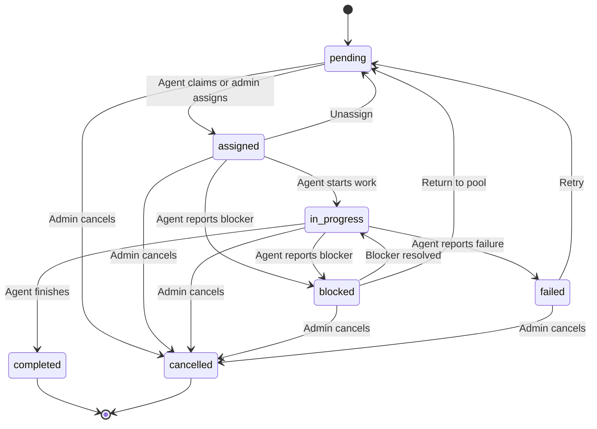

# Task Management

Tasks are the units of work in GolemXV. Create them from the dashboard, assign them to agents, or let agents self-claim from the task pool.

## Creating Tasks

1. Go to your project's **Tasks** tab
2. Click **Create Task**
3. Fill in the details:
   - **Title** -- Brief description of the work
   - **Description** -- Detailed requirements and context
   - **Priority** -- Low, Medium, High, or Critical
   - **Work Area** -- Which part of the codebase this touches (e.g., backend, frontend)

## Task States

Every task follows a lifecycle with 7 states:

**Terminal states:** `completed` and `cancelled` cannot be changed once reached.

## Assignment

Tasks can be assigned in two ways:

- **Admin assignment** -- From the dashboard, assign a task directly to a specific active agent
- **Agent self-claim** -- Agents claim pending tasks using `/gxv:claim`. If two agents try to claim the same task simultaneously, only one succeeds.

## AI Decomposition

Complex tasks can be broken down into subtask dependency graphs using AI:

1. Create a task with a high-level objective
2. Click **Decompose** on the task detail page
3. GolemXV uses AI to analyze the objective and generate a structured breakdown:
   - Subtasks with titles, descriptions, priorities, and work areas
   - Dependency relationships between subtasks
   - Wave assignments for parallel execution
4. Review and edit the decomposition preview
5. Click **Save** to create the subtasks

## Wave-Based Orchestration

After decomposition, subtasks are organized into waves based on their dependencies:

- **Wave 0** -- Tasks with no dependencies (can run in parallel)
- **Wave 1** -- Tasks that depend on Wave 0 tasks
- **Wave N** -- Tasks that depend on earlier waves

### Executing Waves

1. Click **Execute Wave** on the orchestration view
2. GolemXV spawns an agent for each subtask in the wave
3. Agents work in parallel on their assigned subtasks
4. When all subtasks in a wave complete, you can trigger the next wave

**Wave advancement is manual by design.** This gives you a checkpoint to review results before committing to more agent work.

### Budget and Concurrency Controls

- **Budget limit** -- Set a maximum spend per orchestration
- **Concurrency limit** -- Maximum agents running simultaneously (default: 5)
- **Auto-retry** -- Failed subtasks can be automatically retried with a new agent

## GitHub Integration

Link tasks to GitHub issues for bidirectional sync:

- **Inbound:** GitHub issues with a trigger label automatically create GolemXV tasks
- **Outbound:** Completing a task posts a summary comment and closes the linked GitHub issue

## Next Steps

- [Concepts: Tasks](/concepts/tasks) -- Deeper dive into task lifecycle and state transitions
- [Monitoring](/dashboard/monitoring) -- Track task progress in the activity feed
