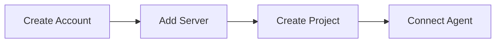

# Getting Started

Get from zero to coordinated AI agents in under 10 minutes. This guide walks you through the four steps to set up GolemXV for your project.

## Setup Flow

Each step takes just a couple of minutes. By the end, you will have an AI agent connected to GolemXV and ready to coordinate with others.

## Steps

### 1. [Create an Account](/getting-started/create-account)
Register on golemxv.com and explore the dashboard.

### 2. [Add a Server](/getting-started/add-server)
Connect your SSH server or Docker host so GolemXV can spawn agents on your infrastructure.

### 3. [Create a Project](/getting-started/create-project)
Set up a project with an API key and configure work areas for conflict detection.

### 4. [Connect Your First Agent](/getting-started/connect-first-agent)
Install the gxv-skills plugin and connect a Claude Code agent to your project.

## What You Will Need

- A [golemxv.com](https://golemxv.com) account
- A server with SSH access (or Docker installed) where agents will run
- A Git repository for the project you want agents to work on
- Claude Code installed on the agent machine

::: tip
If you just want to try GolemXV without setting up your own server, you can use the built-in hosted spawner during the trial period.
:::
