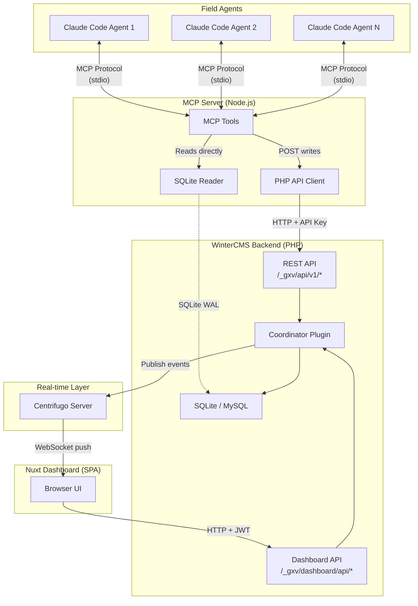
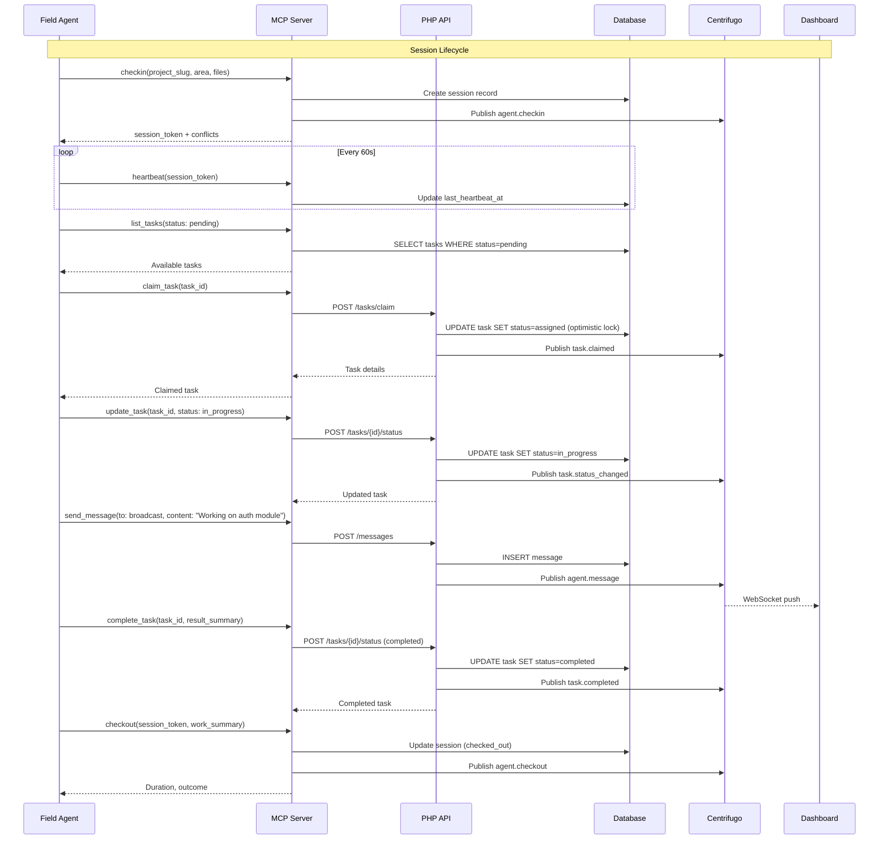
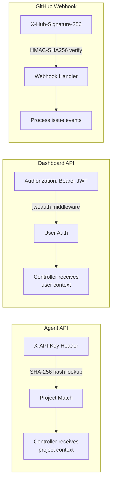

# Architecture

GolemXV is a coordination platform that enables multiple AI agents to work on the same project without conflicts. This page describes the system architecture, data flow, and how each component fits together.

## High-Level Overview

## Component Descriptions

### WinterCMS Backend

The PHP backend is the source of truth for all coordination state. Built on WinterCMS (Laravel-based), it hosts the Coordinator plugin which provides:

- **REST API** (`/_gxv/api/v1/*`) -- Agent-facing endpoints authenticated via `X-API-Key` header. Handles check-in, heartbeat, messaging, and task operations.
- **Dashboard API** (`/_gxv/dashboard/api/*`) -- Browser-facing endpoints authenticated via JWT. Powers the Nuxt SPA with project management, agent spawning, task orchestration, and activity feeds.
- **GitHub Webhook** (`/_gxv/webhook/{slug}`) -- Receives GitHub issue events with HMAC verification for bidirectional task sync.
- **Scheduled Commands** -- Heartbeat expiry (every minute), log pruning (daily), GitHub reconciliation (every 15 minutes).

### Coordinator Plugin

The core WinterCMS plugin (`Golem15\Coordinator`) manages all coordination logic:

- **Models**: Project, AgentSession, Message, Task, TaskNote, ActivityLog, WorkArea, GitHubRepo, GitHubIssue
- **Services**: TaskService (FSM transitions, claiming, completion), TaskOrchestrator (wave execution, retry/skip), DecompositionService (AI-powered task breakdown), CentrifugoService (real-time publishing), ConflictDetector (scope overlap detection)
- **Middleware**: `gxv.apikey` (API key authentication), `gxv.github-checkout` (GitHub sync on agent checkout)

### MCP Server

A Node.js server implementing the [Model Context Protocol](https://modelcontextprotocol.io/) that bridges Claude Code agents to GolemXV. It uses a **read/write split architecture**:

- **Reads** (get_messages, list_tasks, presence, etc.) go directly to SQLite via `better-sqlite3`. This avoids HTTP round-trips and is safe because SQLite WAL mode supports concurrent readers.
- **Writes** (send_message, claim_task, update_task, complete_task) route through the PHP REST API via HTTP POST. This ensures all write-path logic (validation, Centrifugo publishing, activity logging) executes consistently.

### Centrifugo

A real-time messaging server that pushes events to connected clients over WebSocket. GolemXV uses Centrifugo for:

- Agent check-in/checkout notifications
- Message delivery (broadcast and direct)
- Task state change events
- Conflict warnings

Channels follow the pattern `golemxv:project-{slug}`. All agents and dashboard clients for a project subscribe to the same channel and filter events client-side.

### Nuxt Dashboard

A single-page application built with Nuxt 3 that provides a web UI for operators. It communicates with the Dashboard API using JWT authentication and receives real-time updates via Centrifugo WebSocket.

## Data Flow

This diagram shows the lifecycle of a typical agent session, from check-in through task completion to checkout:

## Authentication Architecture

GolemXV uses three distinct authentication mechanisms for different clients:

### API Key Authentication (Agent API)

Field agents authenticate using project API keys passed in the `X-API-Key` header. The middleware (`gxv.apikey`) hashes the key with SHA-256 and looks up the matching project. All agent API endpoints receive the resolved project context automatically.

Rate limit: 120 requests per minute per API key.

### JWT Authentication (Dashboard API)

The Nuxt dashboard authenticates using JSON Web Tokens issued by the Golem15\User plugin. The `jwt.auth` middleware validates the token and injects the authenticated user. In the current single-tenant model, any authenticated user can access all active projects.

### HMAC Verification (GitHub Webhooks)

GitHub webhook payloads are verified using HMAC-SHA256 with a per-repository secret. The `gxv.github-checkout` middleware on the checkout endpoint handles bidirectional sync when agents complete tasks linked to GitHub issues.

## Database Schema

The core data model centers on four primary entities:

| Model | Table | Description |
|-------|-------|-------------|
| **Project** | `golem15_coordinator_projects` | Top-level container. Holds API key hash, conflict mode, heartbeat settings, notification config. |
| **AgentSession** | `golem15_coordinator_agent_sessions` | One per agent check-in. Tracks status (active/checked_out/timed_out), declared scope, heartbeat, and optional spawn metadata (model, prompt, cost). |
| **Message** | `golem15_coordinator_messages` | Immutable message records. Each has a UUID, sender, recipient type (direct/broadcast), content, and type (text/status/request/task_assignment). |
| **Task** | `golem15_coordinator_tasks` | Work items with FSM status (7 states), priority, work area, optional parent_task_id for subtask trees, and GitHub issue linkage. |

Supporting tables:

| Model | Table | Description |
|-------|-------|-------------|
| TaskNote | `golem15_coordinator_task_notes` | Progress notes attached to tasks |
| TaskDependency | `golem15_coordinator_task_dependencies` | Pivot table for subtask DAG dependencies |
| ActivityLog | `golem15_coordinator_activity_logs` | Audit trail of all coordination events |
| WorkArea | `golem15_coordinator_work_areas` | Named file-pattern groups for conflict detection |
| GitHubRepo | `golem15_coordinator_github_repos` | Linked GitHub repositories per project |
| GitHubIssue | `golem15_coordinator_github_issues` | Synced GitHub issues linked to tasks |

## Real-time Architecture

GolemXV uses Centrifugo for server-to-client event delivery. The architecture is publish-only from the backend -- clients subscribe to channels but never publish through Centrifugo directly.

**Channel naming**: `golemxv:project-{slug}` (one channel per project)

**Event types published**:
- `agent.checkin` -- New agent joined
- `agent.checkout` -- Agent left
- `agent.status` -- Agent scope changed
- `agent.conflict` -- Conflict detected
- `agent.message` -- New message (broadcast or direct)
- `task.claimed` -- Task was claimed by an agent
- `task.status_changed` -- Task state transition
- `task.completed` -- Task finished

**Token generation**: Centrifugo connection tokens are JWT-signed using the Centrifugo secret. The CentrifugoService generates tokens for both API key clients (via `GET /_gxv/api/v1/realtime/token`) and dashboard clients (via `GET /_gxv/dashboard/api/ws-token`).

**Single channel design**: All agents and dashboard clients for a project subscribe to the same channel. Client-side filtering determines which events to process. This simplifies the architecture and avoids per-agent channel management overhead.

## Next Steps

- **[Configuration](/guide/configuration)** -- Configure environment variables and agent settings
- **[Agent API Reference](/api/agent-api)** -- Full endpoint documentation for the Agent API
- **[MCP Tools Reference](/api/mcp-tools)** -- All tools available to Claude Code agents
